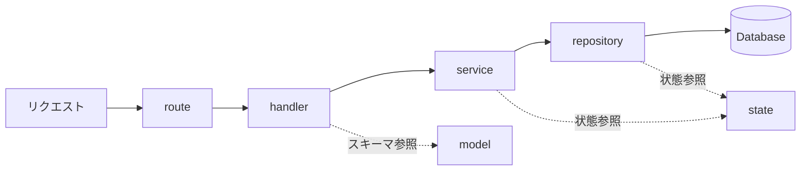

# 設計思想

単一クレートの中を **handler / service / repository** の 3 層に分けている。

`sqlx` のコンパイル時チェックマクロ（`sqlx::query!` 等）は使わず、実行時にクエリを組み立てる API（`sqlx::query` / `sqlx::query_as`）を使う。DB コンテナを立ち上げていないとコンパイルが失敗するのと、オフラインキャッシュ（`.sqlx/`）の更新漏れが起きるのを避けるため。

## ディレクトリ構成

| パス | 役割 |
| --- | --- |
| `src/main.rs` | 起動処理。ロガー、CORS、ルーターの組み立て。 |
| `src/route/` | ルーティング定義。 |
| `src/handler/` | リクエストの受け取りとレスポンスの組み立て。処理は service に委譲する。 |
| `src/service/` | ビジネスロジック。axum の型には依存させない。 |
| `src/repository/` | SQL の発行。`&PgPool` を引数に取る関数として実装する。 |
| `src/model/` | リクエスト・レスポンスのスキーマとエンティティID。 |
| `src/state.rs` | `AppState`。接続プールと設定値を保持する。 |
| `src/db.rs` | 接続プールの生成、トランザクションの補助。 |
| `src/config.rs` | 環境変数の読み込み。 |
| `src/error.rs` | `AppError`（内部エラー）と `ApiError`（クライアントに返すエラー）。 |
| `src/response.rs` | 共通のレスポンス形式。 |

### 自動生成されるファイル

`generator` が生成するため、直接編集しない。

| パス | 生成元 |
| --- | --- |
| `src/error_code.rs` | `generator/src/seed/errors/` |
| `src/kbn.rs` | `generator/src/seed/kbns/` |
| `src/model/id.rs` | `generator/src/seed/entity_ids/` |
| `src/model/generated/` | `generator/src/seed/api_schemas/` |
| `src/handler/generated/`, `src/route/generated/` | `generator/src/seed/api_endpoints/` |
| `migrations/test_setup_start.sql` | `generator/src/seed/tables/` |

`src/handler/handlers/` は**初回のみ**スタブが生成され、以降は手で実装する。
`src/handler/custom/` と `src/route/custom/` は generator を通さない手書きのハンドラを置く。

### 依存の向き

**上の層から下の層へ一方向にのみ依存する。** repository が service を呼ぶ、handler が repository を直接呼ぶといった実装はしない。

## 開発の進め方

1. `generator/src/seed/` に定義を書いて自動生成する（`sampleapp local generate`）。
1. repository → service → handler の順に実装する。
1. 生成されたハンドラのスタブの `todo!()` を解消する。

## テスト戦略

`Arc<dyn Trait>` によるリポジトリの抽象化を行っていないため、モックを差し込んだユニットテストは書けない。
代わりに、テスト用データベースへ実際に接続する統合テストで担保する。

| 層 | テスト方針 |
| --- | --- |
| repository | テスト用 DB に接続し、発行する SQL が意図どおりかを確認する。 |
| service | テスト用 DB に接続し、ロジックが正しいかを確認する。 |
| handler / route | パスとパラメータが正しく解釈されるかを確認する。 |
