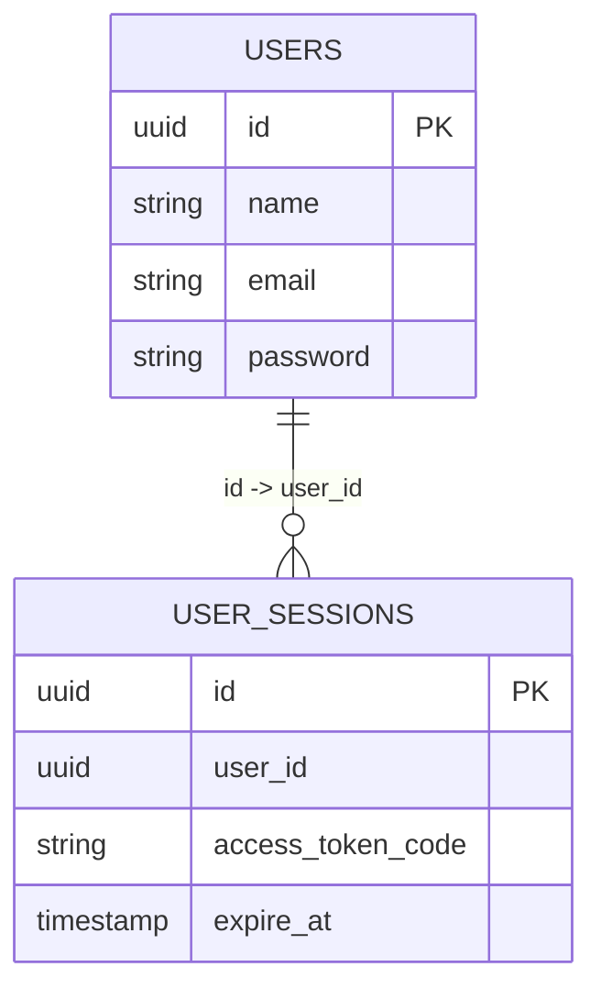

# ER図

このファイルは generator/src/generators/tables.ts から生成されます。
直接編集しないでください。

## テーブル一覧

- [user_sessions](./tables/user_sessions.md)
- [users](./tables/users.md)

## ER図

```mermaid
erDiagram

  USERS {
    uuid id PK
    string name
    string email
    string password
  }
  USER_SESSIONS {
    uuid id PK
    uuid user_id
    string access_token_code
    timestamp expire_at
  }

  USERS ||--o{ USER_SESSIONS : "id -> user_id"
```
