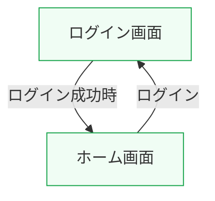

# 画面遷移図

このファイルは generator/src/generators/pages.ts から生成されます。
直接編集しないでください。

## 画面一覧

- [ホーム画面(Home)](./pages/home.md)
- [ログイン画面(Login)](./pages/login.md)

## 凡例

- 🔒 認証が必要な画面
- 緑枠: 公開画面
- 青枠: 認証必須画面

## 画面遷移図

